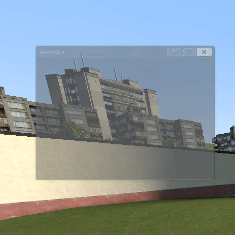
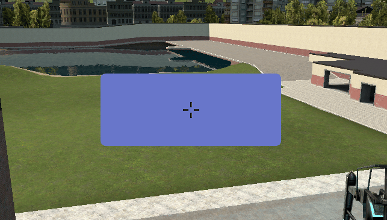
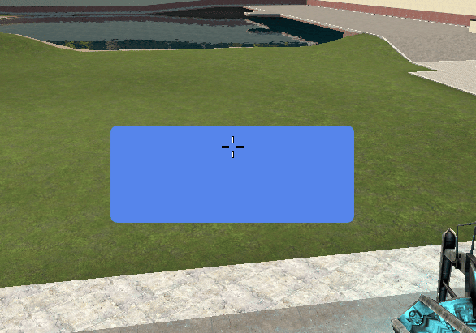
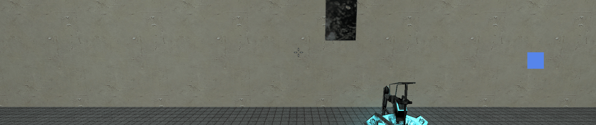

# Вёрстка и анимация

## Адаптивные размеры

Размеры задаются относительно 1920x1080 и подгоняются под монитор.

```js
local width = Mantle.func.w(400)
local height = Mantle.func.h(300)
```

## Анимация появления панели



```js
local frame = vgui.Create('DFrame')
frame:SetTitle('Анимация')
frame:SetPos(200, 100)

Mantle.func.animate_appearance(frame, 400, 300, 5, 6, function()
    print('Анимация завершена')
end, 0.8)
```

| Аргумент               | Тип      | Описание                                                 |
| ---------------------- | -------- | -------------------------------------------------------- |
| `panel`                | `object` | Панель                                                   |
| `target_w`, `target_h` | `int`    | Целевой размер панели                                    |
| `duration`             | `int`    | Длительность роста в секундах. Например `5`              |
| `alpha_dur`            | `int`    | Длительность проявления прозрачности. Например `6`       |
| `callback`             | `func`   | Вызывается после завершения анимации. Опционально        |
| `scale_factor`         | `int`    | Стартовый размер в долях от целевого. По умолчанию `0.8` |

## Плавный переход цвета

Каждый кадр цвет приближается к целевому. `frac` это скорость приближения за кадр (например `0.1`).



```js
local col = Mantle.color.theme

hook.Add('HUDPaint', 'Test', function()
    col = Mantle.func.LerpColor(0.1, col, Color(182, 65, 65))

    local w, h = 300, 120
    local x, y = (ScrW() - w) / 2, (ScrH() - h) / 2

    RNDX.Rect(x, y, w, h)
        :Rad(16)
        :Color(col)
    :Draw()
end)
```

## Экспоненциальное приближение

`approachExp(current, target, speed, dt)` плавно приближает значение к целевому. Подходит для инерционных движений: квадрат плавно съезжает вниз.



```js
local offset = 0
local target = 200

hook.Add('HUDPaint', 'Test', function()
    offset = Mantle.func.approachExp(offset, target, 10, FrameTime())

    local w, h = 300, 120
    local x, y = (ScrW() - w) / 2, (ScrH() - h) / 2

    RNDX.Rect(x, y + offset, w, h)
        :Rad(16)
        :Color(Mantle.color.theme)
    :Draw()
end)
```

## Easing-функции

`t` это прогресс от 0 до 1. Квадрат ездит по экрану с ускорением/замедлением.



```js
local duration = 2

hook.Add('HUDPaint', 'Test', function()
    local elapsed = (CurTime() % duration) / duration

    -- Быстрый старт, плавное окончание
    local t = Mantle.func.easeOutCubic(elapsed)

    -- Плавные старт, быстрое окончание
    -- local t = Mantle.func.easeInOutCubic(elapsed)

    local size = 50
    local x = ScrW() * 0.1 + t * (ScrW() * 0.8 - size)

    RNDX.Rect(x, ScrH() * 0.5, size, size)
        :Color(Mantle.color.theme)
    :Draw()
end)
```

Доступны две функции: `easeOutCubic` (быстрый старт, плавное окончание) и `easeInOutCubic` (плавные старт и окончание). Раскомментируйте нужную строку.

## Ограничение позиции экраном

Не даёт панели выйти за границы экрана.

```js
local menu = vgui.Create('DPanel')
menu:SetSize(200, 100)
menu:SetPos(ScrW() - 50, ScrH() - 50)

Mantle.func.ClampMenuPosition(menu)
```
