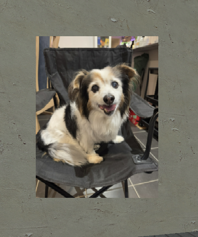

# URL материал

Скачивает картинку по ссылке и отдаёт материал.



```js
http.DownloadMaterial('https://i.imgur.com/eEnGbcp.jpeg', 'dog.png', function(mat)
    hook.Add('HUDPaint', 'Test', function()
        surface.SetDrawColor(255, 255, 255)
        surface.SetMaterial(mat)
        surface.DrawTexturedRect(100, 100, 250, 330)
    end)
end)
```

| Аргумент      | Тип      | Описание                                    |
| ------------- | -------- | ------------------------------------------- |
| `url`         | `string` | Ссылка на изображение                       |
| `path`        | `string` | Имя файла в `data/mantle/materials/`        |
| `callback`    | `func`   | Вызывается с готовым материалом             |
| `retry_count` | `int`    | Количество повторов при ошибке. Опционально |
