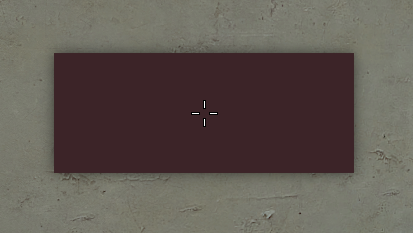

# Legacy Shadows

Отрисовка теней через Render Targets. Это устаревшая система, для новых проектов используйте встроенную тень RNDX через `:Shadow()`.

## Пример



```js
local w, h = 300, 120
local x, y = (ScrW() - w) / 2, (ScrH() - h) / 2

hook.Add('HUDPaint', 'Test', function()
    BShadows.BeginShadow()
        RNDX.Rect(x, y, w, h)
            :Color(Mantle.color.panel[1])
        :Draw()
    BShadows.EndShadow(1, 2, 2, 255, 0, 0)
end)
```

## Параметры EndShadow

| Аргумент      | Тип      | Описание                          |
| ------------- | -------- | --------------------------------- |
| `intensity`   | `number` | Интенсивность тени                |
| `spread`      | `number` | Размер распространения            |
| `blur`        | `number` | Размытие                          |
| `opacity`     | `number` | Прозрачность                      |
| `direction`   | `number` | Направление                       |
| `distance`    | `number` | Дистанция от объекта              |
| `shadow_only` | `bool`   | Рисовать только тень. Опционально |
