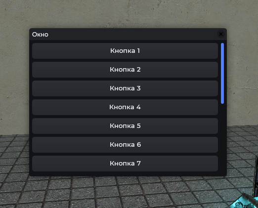
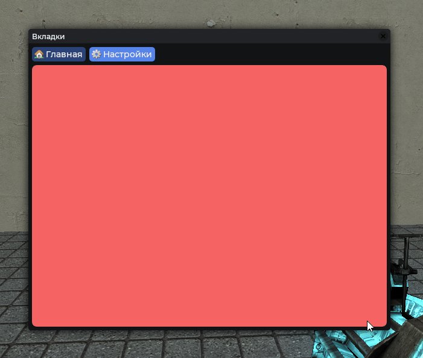

# Legacy UI

Функции оформления для стандартных VGUI-элементов (`DFrame`, `DButton` и др.). Существуют для поддержания старых скриптов. Для новых проектов используйте элементы `Mantle`.

## Отличие от новых элементов

| Legacy                 | Новый элемент                   |
| ---------------------- | ------------------------------- |
| `Mantle.ui.frame`      | `vgui.Create('MantleFrame')`    |
| `Mantle.ui.btn`        | `vgui.Create('MantleBtn')`      |
| `Mantle.ui.slidebox`   | `vgui.Create('MantleSlideBox')` |
| `Mantle.ui.checkbox`   | `vgui.Create('MantleCheckBox')` |
| `Mantle.ui.desc_entry` | `vgui.Create('MantleEntry')`    |
| `Mantle.ui.panel_tabs` | `vgui.Create('MantleTabs')`     |

## Пример



```js
local frame = vgui.Create('DFrame')
Mantle.ui.frame(frame, 'Окно', 600, 500, true, true)
frame:Center()
frame:MakePopup()

local scroll = vgui.Create('DScrollPanel', frame)
Mantle.ui.sp(scroll)
scroll:Dock(FILL)

for k = 1, 15 do
    local btn = vgui.Create('DButton', scroll)
    Mantle.ui.btn(btn)
    btn:Dock(TOP)
    btn:DockMargin(0, 0, 0, 6)
    btn:SetText('Кнопка ' .. k)
end
```

## Функции

### Mantle.ui.frame

Оформление для `DFrame`.

```js
local frame = vgui.Create('DFrame')
Mantle.ui.frame(frame, 'Окно', 600, 500, true, true)
frame:Center()
frame:MakePopup()
```

### Mantle.ui.sp

Оформление для `DScrollPanel`.

```js
local frame = vgui.Create('DFrame')
Mantle.ui.frame(frame, 'Список', 600, 500, true, true)
frame:Center()
frame:MakePopup()

local scroll = vgui.Create('DScrollPanel', frame)
Mantle.ui.sp(scroll)
scroll:Dock(FILL)

for k = 1, 15 do
    local btn = vgui.Create('DButton', scroll)
    Mantle.ui.btn(btn)
    btn:Dock(TOP)
    btn:DockMargin(0, 0, 0, 6)
    btn:SetText('Кнопка ' .. k)
end
```

### Mantle.ui.btn

Оформление для `DButton`.

```js
local frame = vgui.Create('DFrame')
Mantle.ui.frame(frame, 'Кнопки', 600, 500, true, true)
frame:Center()
frame:MakePopup()

local btn = vgui.Create('DButton', frame)
Mantle.ui.btn(btn, Material('icon16/delete.png'), 16)
btn:SetPos(20, 40)
btn:SetSize(180, 40)
btn:SetText('Удалить')
```

### Mantle.ui.slidebox

Слайдер, привязанный к ConVar.

```js
local frame = vgui.Create('DFrame')
Mantle.ui.frame(frame, 'Включение интерфейса', 600, 500, true, true)
frame:Center()
frame:MakePopup()

local slider = Mantle.ui.slidebox(frame, 'Параметр', 0, 5, 'cl_drawhud', 0)
slider:SetPos(20, 40)
slider:SetWide(400)
```

### Mantle.ui.desc_entry

Поле ввода с заголовком. Возвращает entry и его фон.

```js
local frame = vgui.Create('DFrame')
Mantle.ui.frame(frame, 'Ввод', 600, 500, true, true)
frame:Center()
frame:MakePopup()

local entry, bg = Mantle.ui.desc_entry(frame, 'Никнейм', 'Введите ник...')
bg:SetPos(20, 40)
bg:SetWide(400)
```

### Mantle.ui.checkbox

Тумблер, привязанный к ConVar. Возвращает панель и кнопку.

```js
local frame = vgui.Create('DFrame')
Mantle.ui.frame(frame, 'Настройки', 600, 500, true, true)
frame:Center()
frame:MakePopup()

local panel, option = Mantle.ui.checkbox(frame, 'Отображение HUD', 'cl_drawhud')
panel:SetPos(20, 40)
```

### Mantle.ui.panel_tabs

Панель вкладок. Настройка через `:AddTab(title, panel, icon, col, col_hov)` и `:ActiveTab(title)`.



```js
local frame = vgui.Create('DFrame')
Mantle.ui.frame(frame, 'Вкладки', 600, 500, true, true)
frame:Center()
frame:MakePopup()

local tabs = Mantle.ui.panel_tabs(frame)
tabs:Dock(FILL)
tabs:DockMargin(20, 30, 20, 20)

local page1 = vgui.Create('DPanel')
tabs:AddTab('Главная', page1, 'icon16/house.png')

local page2 = vgui.Create('DPanel')
tabs:AddTab('Настройки', page2, 'icon16/cog.png')

tabs:ActiveTab('Настройки')
```
