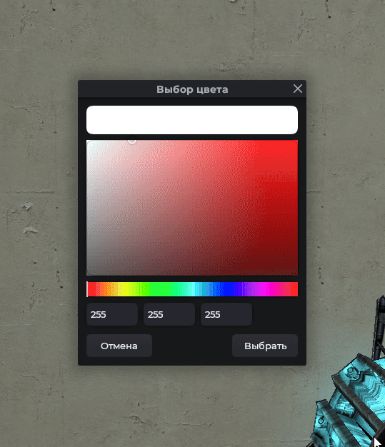
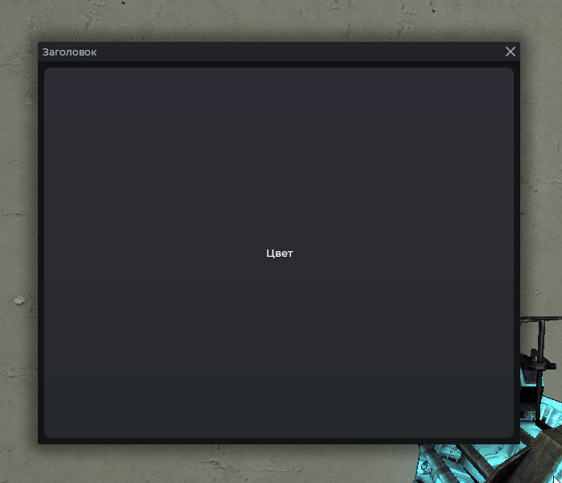

# Выбор цвета

Окно выбора цвета с палитрой и ползунками. Создаётся через `Mantle.ui.color_picker(callback, defaultColor)`, результат приходит в `callback`.

## Пример



```js
Mantle.ui.color_picker(function(color)
    print(color.r, color.g, color.b)
end)
```

## С цветом по умолчанию

```js
Mantle.ui.color_picker(function(color)
    print('Новый цвет:', color.r, color.g, color.b)
end, Color(182, 65, 65))
```

## Применение к элементу



```js
local frame = vgui.Create('MantleFrame')
frame:SetSize(600, 500)
frame:Center()
frame:MakePopup()

local btn = vgui.Create('MantleBtn', frame)
btn:Dock(FILL)
btn:SetTxt('Цвет')

btn.DoClick = function()
    Mantle.ui.color_picker(function(color)
        btn:SetColor(color)
    end, btn:GetColor())
end
```

## Аргументы

| Аргумент       | Тип        | Описание                           |
| -------------- | ---------- | ---------------------------------- |
| `callback`     | `function` | Вызывается с выбранным `Color`     |
| `defaultColor` | `Color`    | Начальный цвет в окне. Опционально |
