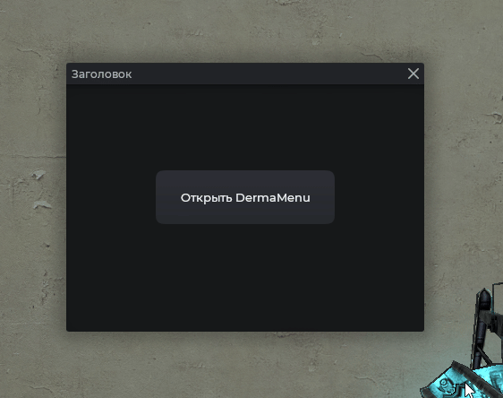
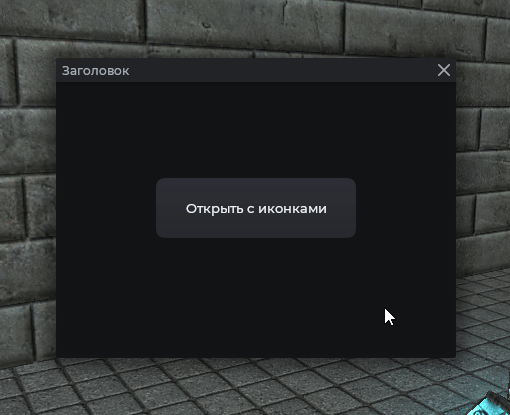
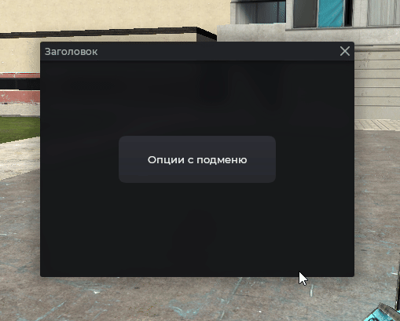

# Контекстное меню

Контекстное меню, что открывается у курсора.

## Пример



```js
local frame = vgui.Create('MantleFrame')
frame:SetSize(400, 300)
frame:Center()
frame:MakePopup()

local btn = vgui.Create('MantleBtn', frame)
btn:SetSize(200, 60)
btn:Center()
btn:SetTxt('Открыть DermaMenu')

btn.DoClick = function()
    local dm = Mantle.ui.derma_menu()
    dm:AddOption('Выбрать яблоко', function()
        print('Яблоко')
    end)
    dm:AddOption('Выбрать банан', function()
        print('Банан')
    end)
end
```

## Пункты с иконками



```js
local frame = vgui.Create('MantleFrame')
frame:SetSize(400, 300)
frame:Center()
frame:MakePopup()

local btn = vgui.Create('MantleBtn', frame)
btn:SetSize(200, 60)
btn:Center()
btn:SetTxt('Открыть с иконками')

btn.DoClick = function()
    local dm = Mantle.ui.derma_menu()
    dm:AddOption('Сохранить', function() end, 'icon16/disk.png')
    dm:AddOption('Удалить', function() end, 'icon16/delete.png')
end
```

## Подменю



```js
local frame = vgui.Create('MantleFrame')
frame:SetSize(400, 300)
frame:Center()
frame:MakePopup()

local btn = vgui.Create('MantleBtn', frame)
btn:SetSize(200, 60)
btn:Center()
btn:SetTxt('Опции с подменю')

btn.DoClick = function()
    local menu = Mantle.ui.derma_menu()

    local sub = menu:AddOption('Действия', function() end)
    local submenu = sub:AddSubMenu()
    submenu:AddOption('Переименовать', function() end)
    submenu:AddOption('Дублировать', function() end)
end
```

## Методы

| Метод                                                 | Описание                                   |
| ----------------------------------------------------- | ------------------------------------------ |
| `:AddOption(string text, function func, string icon)` | Добавить пункт. Возвращает созданный пункт |
| `:AddSpacer()`                                        | Линия-разделитель                          |
| `:CloseMenu()`                                        | Закрыть меню                               |

## Пункт меню

Объект, возвращаемый `AddOption`:

| Метод                         | Описание             |
| ----------------------------- | -------------------- |
| `option:AddSubMenu()`         | Создать подменю      |
| `option:SetIcon(string path)` | Задать иконку пункта |
