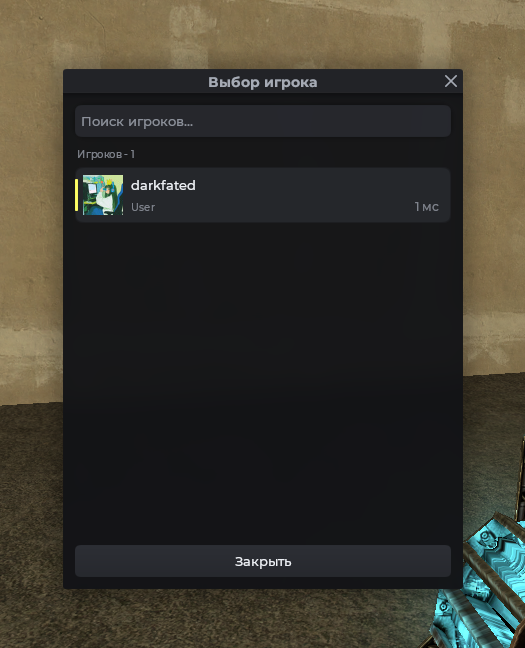

# Выбор игрока

Окно со списком игроков сервера. Игроки сортируются по имени, а также могут показывать игроки с определёнными условиями.

## Пример



```js
Mantle.ui.player_selector(function(pl)
    print('Выбран игрок:', pl:Name())
end)
```

## С фильтром игроков

Второй аргумент решает, кто попадёт в список. Например, только ваша команда:

```js
Mantle.ui.player_selector(function(pl)
    print('Выбран:', pl:Name())
end, function(pl)
    return pl:Team() == TEAM_CITIZEN
end)
```

## Запуск из интерфейса

```js
local frame = vgui.Create('MantleFrame')
frame:SetSize(600, 500)
frame:Center()
frame:MakePopup()

local btn = vgui.Create('MantleBtn', frame)
btn:SetSize(160, 40)
btn:Center()
btn:SetTxt('Выдать админку')

btn.DoClick = function()
    Mantle.ui.player_selector(function(pl)
        RunConsoleCommand('grantrole', pl:SteamID(), 'admin')
    end)
end
```

## Аргументы

| Аргумент   | Тип        | Описание                                                           |
| ---------- | ---------- | ------------------------------------------------------------------ |
| `onSelect` | `function` | Вызывается с выбранным игроком                                     |
| `filterFn` | `function` | Фильтр. Возвращает `true`, чтобы игрок попал в список. Опционально |
