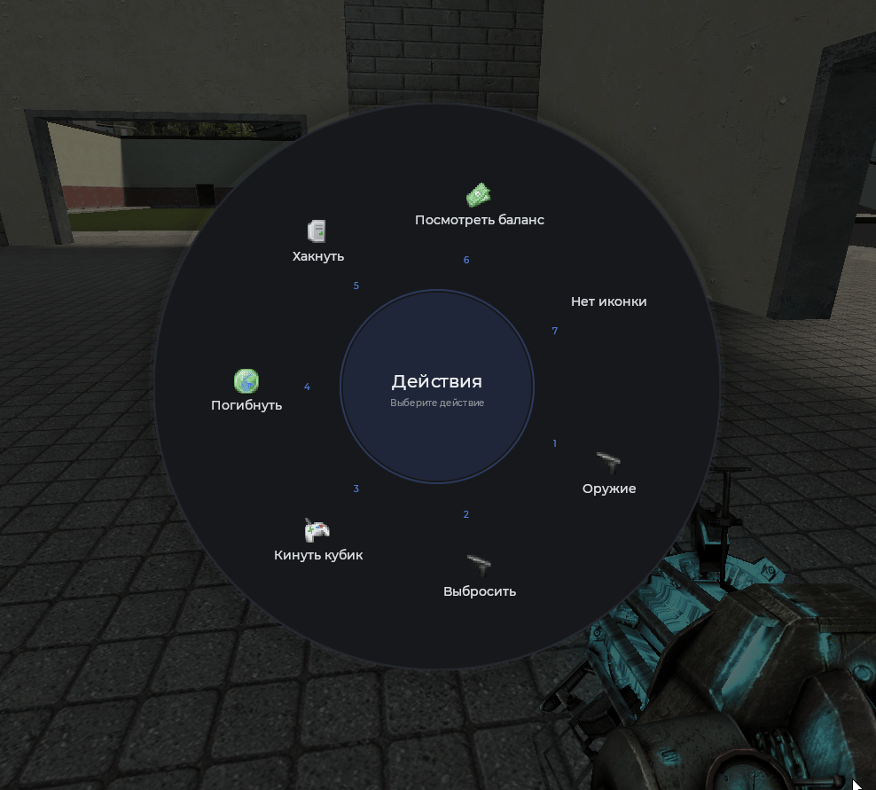
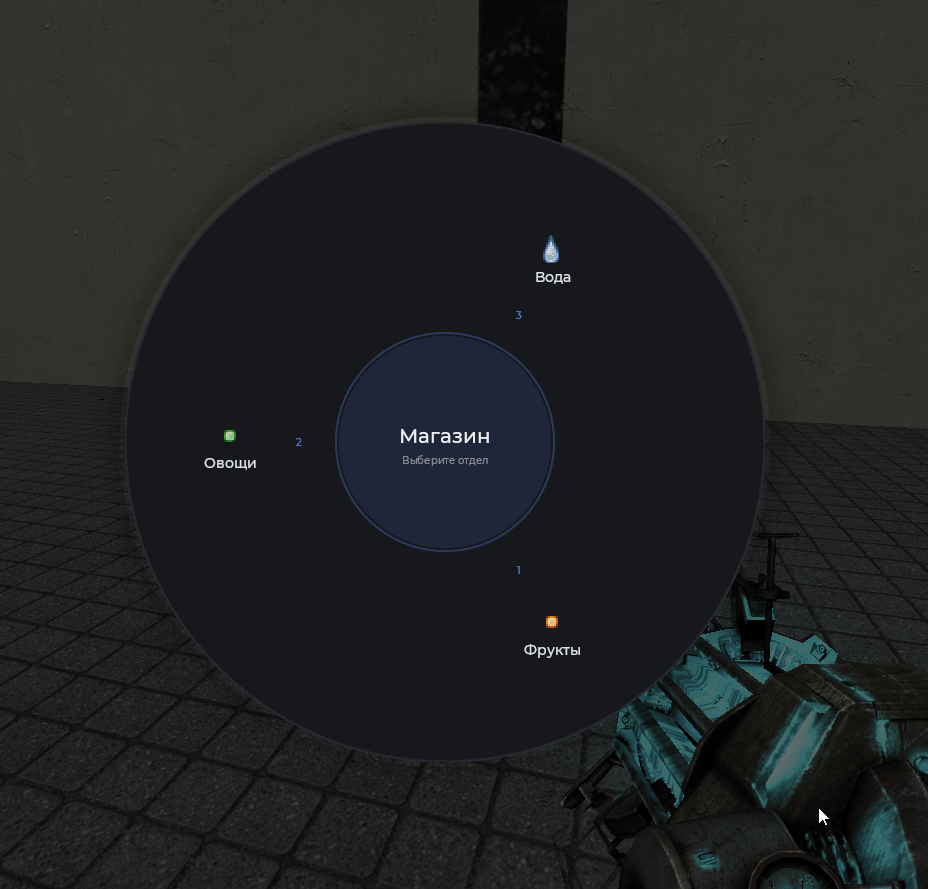

# Радиальное меню

Кольцевое меню с пунктами вокруг центра. Управление с клавиатуры (цифры 1-9), ESC для закрытия, клик в центр возвращает назад. Поддерживает вложенные подменю.



## Пример

```js
local menu = Mantle.ui.radial_menu({
    title = 'Корзина',
    desc = 'Выберите товар',
    radius = 320,
    inner_radius = 110,
    font = 'Fated.20',
    title_font = 'Fated.28',
    desc_font = 'Fated.14'
})

local cart = {}
local total = 0

local function addItem(name, price)
    cart[#cart + 1] = name
    total = total + price
    chat.AddText(Mantle.color.theme, 'В корзине: ' .. name .. ' (+' .. price .. ' руб.)')
    menu:SetCenterText('Корзина', 'Итого: ' .. total .. ' руб.')
end

menu:AddOption('Яблоко', function()
    addItem('Яблоко', 40)
end, 'icon16/bullet_red.png', 'Красное яблоко, 40 руб.')

menu:AddOption('Банан', function()
    addItem('Банан', 30)
end, 'icon16/bullet_yellow.png', 'Спелый банан, 30 руб.')

menu:AddOption('Огурец', function()
    addItem('Огурец', 25)
end, 'icon16/bullet_green.png', 'Хрустящий огурец, 25 руб.')
```

## Подменю

Вложенное меню создаётся через `:CreateSubMenu`, а добавляется в пункт через `:AddSubMenuOption`.



```js
local menu = Mantle.ui.radial_menu({ title = 'Магазин', desc = 'Выберите отдел' })

local fruits = menu:CreateSubMenu('Фрукты', 'Что возьмёте?')
fruits:AddOption('Яблоко', function()
    chat.AddText(Mantle.color.theme, 'Яблоко куплено')
end, 'icon16/bullet_red.png', '40 руб.')
fruits:AddOption('Груша', function()
    chat.AddText(Mantle.color.theme, 'Груша куплена')
end, 'icon16/bullet_yellow.png', '35 руб.')

local vegetables = menu:CreateSubMenu('Овощи', 'Что возьмёте?')
vegetables:AddOption('Помидор', function()
    chat.AddText(Mantle.color.theme, 'Помидор куплен')
end, 'icon16/bullet_red.png', '30 руб.')
vegetables:AddOption('Капуста', function()
    chat.AddText(Mantle.color.theme, 'Капуста куплена')
end, 'icon16/bullet_green.png', '50 руб.')

menu:AddSubMenuOption('Фрукты', fruits, 'icon16/bullet_orange.png', 'Сладкие фрукты')
menu:AddSubMenuOption('Овощи', vegetables, 'icon16/bullet_green.png', 'Свежие овощи')
menu:AddOption('Вода', function()
    chat.AddText(Mantle.color.theme, 'Вода куплена')
end, 'icon16/water.png', 'Бутылка воды')
```

## Настройка вида

```js
local menu = Mantle.ui.radial_menu({
    title = 'Меню',
    desc = 'Выберите действие',
    radius = 320,
    inner_radius = 110,
    font = 'Fated.20',
    title_font = 'Fated.28',
    desc_font = 'Fated.14'
})
```

## Параметры создания

| Параметр             | Тип      | По умолчанию           | Описание                     |
| -------------------- | -------- | ---------------------- | ---------------------------- |
| `title`              | `string` | `Меню`                 | Заголовок в центре           |
| `desc`               | `string` | `Выберите опцию`       | Подзаголовок в центре        |
| `radius`             | `number` | `320`                  | Внешний радиус меню          |
| `inner_radius`       | `number` | `110`                  | Радиус центральной области   |
| `title_font`         | `string` | `Fated.28`             | Шрифт заголовка              |
| `font`               | `string` | `Fated.20`             | Шрифт пунктов                |
| `desc_font`          | `string` | `Fated.14`             | Шрифт подзаголовка           |
| `fade_in_time`       | `number` | `0.18`                 | Длительность появления       |
| `fade_out_time`      | `number` | `0.12`                 | Длительность закрытия        |
| `scale_animation`    | `bool`   | `true`                 | Анимация появления из центра |
| `disable_background` | `bool`   | `false`                | Отключить затемнение фона    |
| `hover_sound`        | `string` | `mantle/ratio_btn.ogg` | Звук при наведении на пункт  |

## Методы

| Метод                                                                     | Описание                                        |
| ------------------------------------------------------------------------- | ----------------------------------------------- |
| `:AddOption(string text, function func, string icon, string desc)`        | Добавить пункт. Возвращает его индекс           |
| `:CreateSubMenu(string title, string desc)`                               | Создать подменю. Возвращает подменю             |
| `:AddSubMenuOption(string text, table submenu, string icon, string desc)` | Добавить пункт, ведущий в подменю               |
| `:SelectOption(int index)`                                                | Выбрать пункт программно                        |
| `:SetCenterText(string title, string desc)`                               | Надпись в центре меню                           |
| `:GetCurrentOptions()`                                                    | Пункты текущего меню (или подменю)              |
| `:GoBack()`                                                               | Вернуться к предыдущему меню                    |
| `:CloseMenu(function callback)`                                           | Закрыть меню. Callback вызовется после закрытия |
| `:IsMouseOver()`                                                          | `true`, если курсор внутри меню                 |

## Управление

- Клавиши `1`-`9` выбирают пункт.
- Клик по центру возвращает на предыдущее подменю (или закрывает, если его нет).
- Клик мимо меню или `ESC` закрывает круговую панель.
