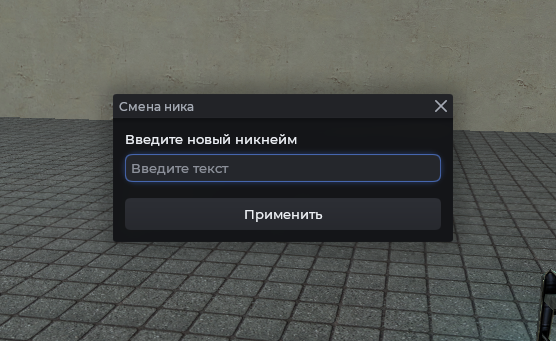

# Текстовое окно

Окно с полем ввода. Подходит для короткого ввода: никнеймы, команды, числа. Создаётся через `Mantle.ui.text_box(title, desc, callback)`.

## Пример



```js
Mantle.ui.text_box('Смена ника', 'Введите новый никнейм', function(text)
    print('Новый ник:', text)
end)
```

## Привер ввод числа

```js
Mantle.ui.text_box('Дальность', 'Максимальная дистанция', function(text)
    local value = tonumber(text)
    if !value then
        print('Некорректное число')
        return
    end
    print('Дальность:', value)
end)
```

## Аргументы

| Аргумент   | Тип        | Описание                       |
| ---------- | ---------- | ------------------------------ |
| `title`    | `string`   | Заголовок окна                 |
| `desc`     | `string`   | Пояснение под заголовком       |
| `callback` | `function` | Вызывается с введённым текстом |
