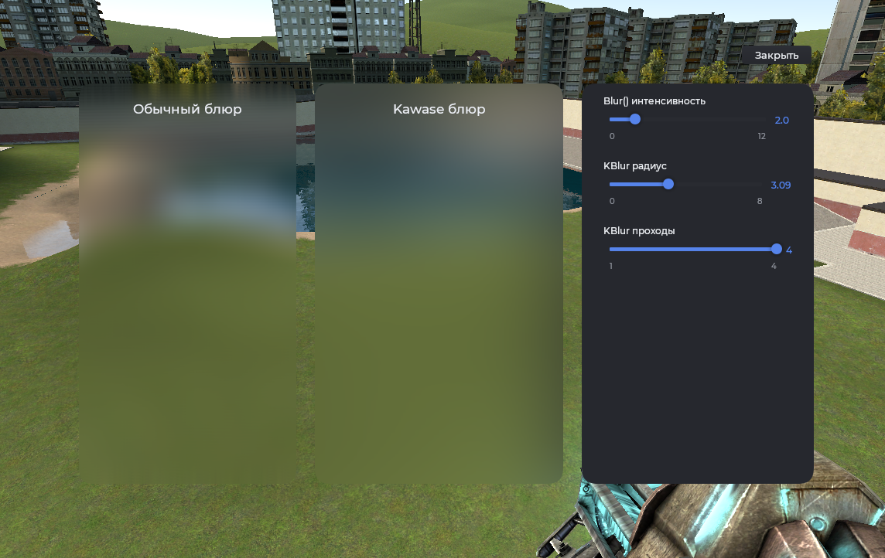

# Модифицированный RNDX

Быстрая отрисовка графических элементов (замена `draw`). Является форком оригинальной версии.

## Прямоугольник

```js
hook.Add('HUDPaint', 'Test', function()
    local w, h = 300, 120
    local x, y = (ScrW() - w) / 2, (ScrH() - h) / 2

    RNDX.Rect(x, y, w, h)
        :Rad(16)
        :Color(Mantle.color.panel[1])
    :Draw()
end)
```

## Скругление

```js
hook.Add('HUDPaint', 'Test', function()
    local w, h = 300, 120
    local x, y = (ScrW() - w) / 2, (ScrH() - h) / 2

    RNDX.Rect(x, y, w, h)
        :Radii(16, 16, 0, 0) -- сверху закругление, снизу нет
        :Color(Mantle.color.panel[1])
    :Draw()
end)
```

## Обводка

```js
hook.Add('HUDPaint', 'Test', function()
    local w, h = 300, 120
    local x, y = (ScrW() - w) / 2, (ScrH() - h) / 2

    RNDX.Rect(x, y, w, h)
        :Rad(16)
        :Outline(2)
        :Color(Mantle.color.panel[1])
    :Draw()
end)
```

## Круг

```js
hook.Add('HUDPaint', 'Test', function()
    local cx, cy = ScrW() / 2, ScrH() / 2

    RNDX.Circle(cx, cy, 30)
        :Color(Color(182, 65, 65))
    :Draw()
end)
```

## Тень под фигурой

```js
hook.Add('HUDPaint', 'Test', function()
    local w, h = 300, 120
    local x, y = (ScrW() - w) / 2, (ScrH() - h) / 2

    RNDX.Rect(x, y, w, h)
        :Rad(16)
        :Shadow(20, 4, 0, 2)
    :Draw()

    RNDX.Rect(x, y, w, h)
        :Rad(16)
        :Color(Mantle.color.panel[1])
    :Draw()
end)
```

## Размытие фона

```js
hook.Add('HUDPaint', 'Test', function()
    local w, h = 300, 120
    local x, y = (ScrW() - w) / 2, (ScrH() - h) / 2

    RNDX.Rect(x, y, w, h)
        :Rad(16)
        :Blur(2)
    :Draw()
end)
```

## Kawase размытие фона



```js
local blur = 2
local kradius = 1
local kiterations = 4

local function addSlider(parent, text, min, max, decimals, value, setter)
    local slider = vgui.Create('MantleSlideBox', parent)
    slider:Dock(TOP)
    slider:DockMargin(12, 8, 12, 8)
    slider:SetText(text)
    slider:SetRange(min, max, decimals)
    slider:SetValue(value)
    slider.OnValueChanged = function(_, val)
        setter(val)
    end
end

local function openMenu()
    local frame = vgui.Create('DFrame')
    frame:SetSize(960, 600)
    frame:Center()
    frame:MakePopup()
    frame:SetTitle('')
    frame:ShowCloseButton(false)
    frame:SetDraggable(true)
    frame.Paint = nil

    local btnClose = vgui.Create('MantleBtn', frame)
    btnClose:SetSize(90, 24)
    btnClose:SetPos(frame:GetWide() - 98, 4)
    btnClose:SetTxt('Закрыть')
    btnClose:SetRadius(8)
    btnClose.DoClick = function()
        frame:Remove()
    end

    local settings = vgui.Create('Panel', frame)
    settings:Dock(RIGHT)
    settings:SetWide(300)
    settings:DockMargin(24, 24, 0, 24)
    settings.Paint = function(_, w, h)
        RNDX.Rect(0, 0, w, h)
            :Rad(32)
            :Color(Mantle.color.panel[2])
        :Draw()
    end

    addSlider(settings, 'Blur() интенсивность', 0, 12, 1, blur, function(v) blur = v end)
    addSlider(settings, 'KBlur радиус', 0, 8, 2, kradius, function(v) kradius = v end)
    addSlider(settings, 'KBlur проходы', 1, 4, 0, kiterations, function(v) kiterations = v end)

    local main = vgui.Create('Panel', frame)
    main:Dock(FILL)
    main.Paint = nil

    local left = vgui.Create('Panel', main)
    left:Dock(LEFT)
    left:DockMargin(0, 24, 12, 24)
    left.Paint = function(self, w, h)
        RNDX.Rect(0, 0, w, h)
            :Rad(32)
            :Blur(blur)
        :Draw()
        draw.SimpleText('Обычный блюр', 'Fated.24', w * 0.5, 20, Mantle.color.text, TEXT_ALIGN_CENTER)
    end

    local right = vgui.Create('Panel', main)
    right:Dock(FILL)
    right:DockMargin(12, 24, 0, 24)
    right.Paint = function(self, w, h)
        RNDX.Rect(0, 0, w, h)
            :Rad(32)
            :KBlur(kiterations, kradius)
        :Draw()
        draw.SimpleText('Kawase блюр', 'Fated.24', w * 0.5, 20, Mantle.color.text, TEXT_ALIGN_CENTER)
    end

    main.PerformLayout = function(self, w)
        left:SetWide(w * 0.45)
    end
end

concommand.Add('mantle_test_blur', function()
    openMenu()
end)
```

## Сектор круга

```js
hook.Add('HUDPaint', 'Test', function()
    local cx, cy = ScrW() / 2, ScrH() / 2

    -- Угол в градусах: от 0 до 180 (полукруг снизу)
    RNDX.Circle(cx, cy, 40)
        :Angles(0, 180)
        :Color(Mantle.color.theme)
    :Draw()
end)
```

## Отрисовка материала

```js
hook.Add('HUDPaint', 'Test', function()
    local w, h = 300, 120
    local x, y = (ScrW() - w) / 2, (ScrH() - h) / 2

    RNDX.Rect(x, y, w, h)
        :Rad(12)
        :Material(Material('icon16/user.png'))
    :Draw()
end)
```

## Конструкторы

| Конструктор                             | Описание       |
| --------------------------------------- | -------------- |
| `RNDX.Rect(int x, int y, int w, int h)` | Прямоугольник  |
| `RNDX.Circle(int x, int y, int radius)` | Круг по центру |

## Модификаторы

| Модификатор                                                 | Описание                                                               |
| ----------------------------------------------------------- | ---------------------------------------------------------------------- |
| `:Rad(int rad)` / `:Radii(int tl, int tr, int bl, int br)`  | Скругление углов                                                       |
| `:Color(color col)`                                         | Цвет заливки                                                           |
| `:Outline(int thickness)`                                   | Обводка вместо заливки. По умолчанию 1                                 |
| `:Texture(ITexture)` / `:Material(IMaterial)`               | Отрисовка текстуры / материала                                         |
| `:Blur(int intensity)`                                      | Размытие фона внутри фигуры                                            |
| `:KBlur(int iterations, int radius)`                        | Kawase размытие фона внутри фигуры                                     |
| `:Fade(int top, int bottom)`                                | Вертикальное затухание. Например `:Fade(1, 0)` прозрачно снизу         |
| `:Shadow(int blur, int spread, int offset_x, int offset_y)` | Тень под фигурой                                                       |
| `:Rotation(int deg)`                                        | Поворот фигуры                                                         |
| `:Angles(int start, int end)`                               | Сектор круга                                                           |
| `:Clip(object panel)`                                       | Обрезать отрисовку по границам панели                                  |
| `:Flags(int flags)`                                         | Быстрые флаги: `RNDX.NO_TL/TR/BL/BR`, `RNDX.BLUR`, `RNDX.MANUAL_COLOR` |
| `:Draw()`                                                   | Завершить и нарисовать фигуру                                          |
