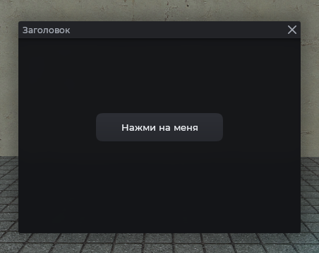
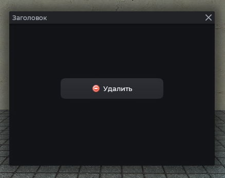
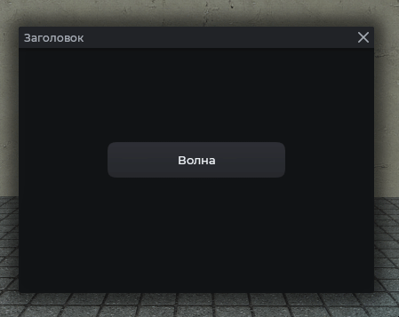
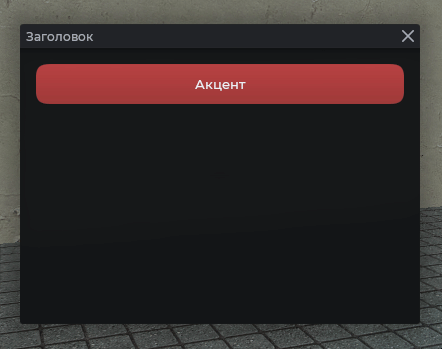
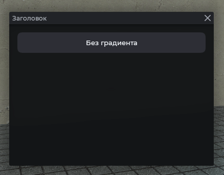
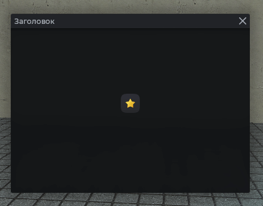

# MantleBtn

Кнопка с настройкой цвета, эффектом волны и другим.

## Пример



```js
local frame = vgui.Create('MantleFrame')
frame:SetSize(600, 400)
frame:Center()
frame:MakePopup()

local btn = vgui.Create('MantleBtn', frame)
btn:SetSize(180, 60)
btn:Center()
btn:SetTxt('Нажми на меня')
btn.DoClick = function()
    chat.AddText('Hello World')
    chat.PlaySound()
end
```

## С иконкой

Иконку можно указывать через текст `:SetIcon("icon16/example.png", 16)` или `:SetIcon(mat_icon, 16)`.



```js
local frame = vgui.Create('MantleFrame')
frame:SetSize(600, 500)
frame:Center()
frame:MakePopup()

local btnIcon = vgui.Create('MantleBtn', frame)
btnIcon:SetSize(200, 40)
btnIcon:Center()
btnIcon:SetTxt('Удалить')
btnIcon:SetIcon(Material('icon16/delete.png'), 16)
```

## С эффектом волны

Волна рисуется от точки клика. Включается через `:SetRipple(true)`.



```js
local frame = vgui.Create('MantleFrame')
frame:SetSize(600, 500)
frame:Center()
frame:MakePopup()

local btnRipple = vgui.Create('MantleBtn', frame)
btnRipple:SetSize(200, 40)
btnRipple:SetTxt('Волна')
btnRipple:SetRipple(true)
```

## Изменение визуала

Параметры кнопки можно переопределять, полный список возможностей найдёте в Методах.



```js
local frame = vgui.Create('MantleFrame')
frame:SetSize(600, 500)
frame:Center()
frame:MakePopup()

local btn = vgui.Create('MantleBtn', frame)
btn:Dock(TOP)
btn:SetTall(40)
btn:DockMargin(8, 8, 8, 8)
btn:SetTxt('Акцент')
btn:SetColor(Color(182, 65, 65))
btn:SetColorHover(Color(210, 90, 90))
btn:SetRadius(32)
```

Отключение градиента и подсветки:



```js
local frame = vgui.Create('MantleFrame')
frame:SetSize(600, 500)
frame:Center()
frame:MakePopup()

local btn = vgui.Create('MantleBtn', frame)
btn:Dock(TOP)
btn:SetTall(40)
btn:DockMargin(8, 8, 8, 8)
btn:SetTxt('Без градиента')
btn:SetGradient(false)
btn:SetHover(false)
```

## Кнопка-иконка

Если текст не задан, кнопка центрирует иконку.



```js
local frame = vgui.Create('MantleFrame')
frame:SetSize(600, 500)
frame:Center()
frame:MakePopup()

local iconBtn = vgui.Create('MantleBtn', frame)
iconBtn:SetSize(32, 32)
iconBtn:Center()
iconBtn:SetTxt('')
iconBtn:SetIcon(Material('icon16/star.png'), 16)
```

## Методы

| Метод                                       | Описание                                     |
| ------------------------------------------- | -------------------------------------------- |
| `:SetTxt(string text)`                      | Текст кнопки                                 |
| `:SetFont(string font)`                     | Шрифт                                        |
| `:SetColor(color color)`                    | Основной цвет кнопки                         |
| `:SetColorHover(color color)`               | Цвет при наведении                           |
| `:SetRadius(int rad)`                       | Скругление углов. По умолчанию `16`          |
| `:SetGradient(bool enabled)`                | Градиент внизу кнопки. По умолчанию `true`   |
| `:SetRipple(bool enabled)`                  | Эффект волны при клике. По умолчанию `false` |
| `:SetHover(bool isHover)`                   | Подсветка при наведении. По умолчанию `true` |
| `:SetIcon(string\|material icon, int size)` | Иконка                                       |

## Примечания

- Остальные методы наследуются от [DButton](https://wiki.facepunch.com/gmod/DButton).
- Стандартные цвета кнопки используют тему Mantle, установка кастомных значений не позволит менять цвета.
