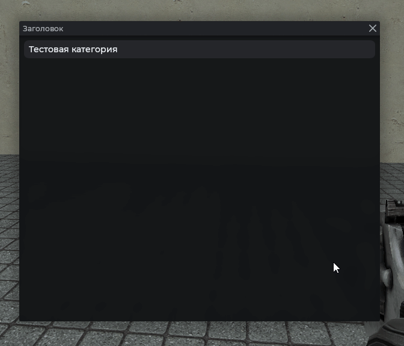
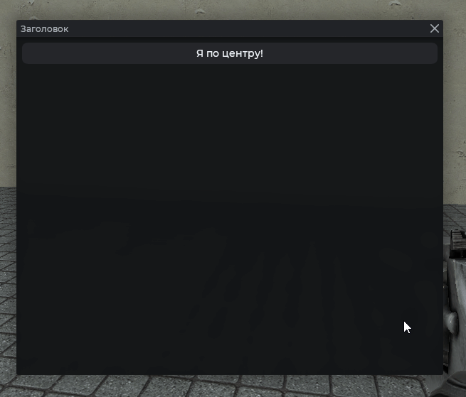

# MantleCategory

Сворачиваемый блок с заголовком и контентом. Клик по заголовку раскрывает или скрывает содержимое.

## Пример



```js
local frame = vgui.Create('MantleFrame')
frame:SetSize(600, 500)
frame:Center()
frame:MakePopup()

local cat = vgui.Create('MantleCategory', frame)
cat:Dock(TOP)
cat:SetText('Тестовая категория')

local pan = vgui.Create('MantleText', cat)
pan:Dock(TOP)
pan:SetTall(300)
pan.Paint = function(_, w, h)
    RNDX.Rect(0, 0, w, h)
        :Rad(32)
        :Color(Color(230, 150, 150))
    :Draw()
end
```

## Раскрыта по умолчанию

```js
local frame = vgui.Create('MantleFrame')
frame:SetSize(600, 500)
frame:Center()
frame:MakePopup()

local cat = vgui.Create('MantleCategory', frame)
cat:Dock(TOP)
cat:SetActive(true) -- по умолчанию false

local pan = vgui.Create('DPanel', cat)
pan:Dock(TOP)
pan:SetTall(300)
```

## Проверка состояния

```js
local frame = vgui.Create('MantleFrame')
frame:SetSize(600, 500)
frame:Center()
frame:MakePopup()

local cat = vgui.Create('MantleCategory', frame)
cat:Dock(TOP)
cat:SetText('Блок')

if !cat:IsActive() then
    print('Категория не раскрыта')
end
```

## Центрирование заголовка



```js
local frame = vgui.Create('MantleFrame')
frame:SetSize(600, 500)
frame:Center()
frame:MakePopup()

local cat = vgui.Create('MantleCategory', frame)
cat:Dock(TOP)
cat:SetText('Я по центру!')
cat:SetCenterText(true)

local pan = vgui.Create('MantleText', cat)
pan:Dock(TOP)
pan:SetTall(300)
pan.Paint = function(_, w, h)
    RNDX.Rect(0, 0, w, h)
        :Rad(32)
        :Color(Mantle.color.panel_alpha[2])
    :Draw()
end
```

## Свой цвет заголовка

```js
local frame = vgui.Create('MantleFrame')
frame:SetSize(600, 500)
frame:Center()
frame:MakePopup()

local cat = vgui.Create('MantleCategory', frame)
cat:Dock(TOP)
cat:SetText('Важно')
cat:SetColor(Color(182, 65, 65))
```

## Методы

| Метод                              | Описание                                  |
| ---------------------------------- | ----------------------------------------- |
| `:SetText(string text)`            | Заголовок категории                       |
| `:AddItem(panel)`                  | Добавить панель в содержимое              |
| `:SetColor(color col)`             | Цвет заголовка                            |
| `:SetCenterText(bool is_centered)` | Заголовок по центру. По умолчанию `false` |
| `:SetActive(bool is_active)`       | Раскрыть или свернуть категорию           |
| `:IsActive()`                      | `true`, если категория раскрыта           |
| `:Clear()`                         | Очистить содержимое                       |

## Примечания

- Категория по умолчанию свёрнута.
