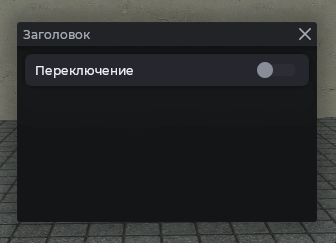

# MantleCheckBox

Тумблер с текстом и кружком. Может быть привязан к ConVar: тогда значение синхронизируется автоматически.

## Пример



```js
local frame = vgui.Create('MantleFrame')
frame:SetSize(600, 500)
frame:Center()
frame:MakePopup()

local checkbox = vgui.Create('MantleCheckBox', frame)
checkbox:SetWide(300)
checkbox:Center()
checkbox:SetTxt('Переключение')
```

## Чтение состояния

```js
local frame = vgui.Create('MantleFrame')
frame:SetSize(600, 500)
frame:Center()
frame:MakePopup()

local checkbox = vgui.Create('MantleCheckBox', frame)
checkbox:SetWide(300)
checkbox:Center()
checkbox:SetTxt('Тест')

print(checkbox:GetBool())
```

## Установка значения

```js
local frame = vgui.Create('MantleFrame')
frame:SetSize(600, 500)
frame:Center()
frame:MakePopup()

local checkbox = vgui.Create('MantleCheckBox', frame)
checkbox:SetWide(300)
checkbox:Center()
checkbox:SetTxt('Включён сразу')

checkbox:SetValue(true)

print(checkbox:GetBool()) -- true
```

## Привязка к ConVar

При создании элемента значение с ConVar считывается и меняется от `0` до `1`.

```js
local frame = vgui.Create('MantleFrame')
frame:SetSize(600, 500)
frame:Center()
frame:MakePopup()

local checkbox = vgui.Create('MantleCheckBox', frame)
checkbox:SetWide(300)
checkbox:Center()
checkbox:SetTxt('Интерфейс')
checkbox:SetConvar('cl_drawhud')
```

## Обработка изменения

Переопределите `:OnChange`. Он вызывается при любом изменении: нажатие, `SetValue`, синхронизация с ConVar.

```js
local frame = vgui.Create('MantleFrame')
frame:SetSize(600, 500)
frame:Center()
frame:MakePopup()

local checkbox = vgui.Create('MantleCheckBox', frame)
checkbox:SetWide(300)
checkbox:Center()
checkbox:SetTxt('Звук')
checkbox.OnChange = function(self, value)
    if value then
        print('Звук включён')
    else
        print('Звук выключен')
    end
end
```

## Методы

| Метод                                   | Описание                        |
| --------------------------------------- | ------------------------------- |
| `:SetTxt(string text)`                  | Текст                           |
| `:SetValue(bool value)`                 | Установить состояние (вкл/выкл) |
| `:GetBool()`                            | Текущее состояние тумблера      |
| `:SetConvar(string convar)`             | Привязать к ConVar              |
| `:OnChange(panel self, bool new_value)` | Вызывается при переключении     |

## Примечания

- При удалении элемента таймер синхронизации тумблера с ConVar удаляется автоматически.
