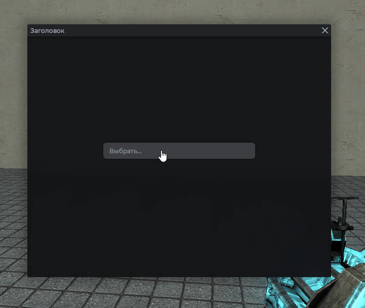

# MantleComboBox

Выпадающий список. Каждая опция может нести дополнительные данные, которые возвращаются при выборе.

## Пример



```js
local frame = vgui.Create('MantleFrame')
frame:SetSize(600, 500)
frame:Center()
frame:MakePopup()

local combo = vgui.Create('MantleComboBox', frame)
combo:SetWide(300)
combo:Center()
combo:AddChoice('День')
combo:AddChoice('Ночь')
combo:AddChoice('Вечер')
```

## Выбор из кода

```js
local frame = vgui.Create('MantleFrame')
frame:SetSize(600, 500)
frame:Center()
frame:MakePopup()

local combo = vgui.Create('MantleComboBox', frame)
combo:SetWide(300)
combo:Center()
combo:AddChoice('Красный')
combo:AddChoice('Синий')

combo:SetValue('Синий')
print(combo:GetValue()) -- "Синий"
```

## Обработка выбора

Переопределите `:OnSelect`. Аргументы: индекс опции, текст, дополнительные данные.

```js
local frame = vgui.Create('MantleFrame')
frame:SetSize(600, 500)
frame:Center()
frame:MakePopup()

local combo = vgui.Create('MantleComboBox', frame)
combo:SetWide(300)
combo:Center()
combo:AddChoice('Лёгкая', {"Палка", "Камень"})
combo:AddChoice('Средняя', 256)
combo:AddChoice('Тяжёлая', {64, 64, 96})

combo.OnSelect = function(index, text, data)
    print('Выбрано:', index, text, data)
end
```

## Placeholder

Пока ничего не выбрано, отображается серая подсказка.

```js
local frame = vgui.Create('MantleFrame')
frame:SetSize(600, 500)
frame:Center()
frame:MakePopup()

local combo = vgui.Create('MantleComboBox', frame)
combo:SetWide(300)
combo:Center()
combo:SetPlaceholder('Выберите режим...')

combo:AddChoice('Выживание')
combo:AddChoice('Постройка')
```

## Методы

| Метод                                         | Описание                             |
| --------------------------------------------- | ------------------------------------ |
| `:AddChoice(string text, any data)`           | Добавить опцию. Возвращает её индекс |
| `:SetValue(string text)`                      | Выбрать опцию по тексту              |
| `:GetValue()`                                 | Текст выбранной опции                |
| `:SetPlaceholder(string text)`                | Подсказка, пока ничего не выбрано    |
| `:OpenMenu()`                                 | Открыть список                       |
| `:CloseMenu()`                                | Закрыть список                       |
| `:OnSelect(int index, string text, any data)` | Вызывается при выборе                |

## Примечания

- Список закрывается при клике мимо него.
- Если `SetValue` вызвать с текстом, которого нет в списке, выбор сбросится.
