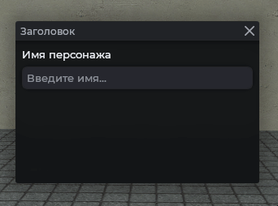
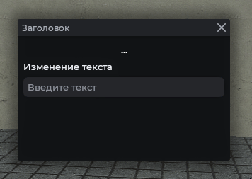

# MantleEntry

Поле ввода с заголовком и плейсхолдером. Внутри использует `DTextEntry`, поэтому доступны все его методы, например `panel.textEntry:SetNumeric(true)`.

## Пример



```js
local frame = vgui.Create('MantleFrame')
frame:SetSize(600, 500)
frame:Center()
frame:MakePopup()

local entry = vgui.Create('MantleEntry', frame)
entry:SetWide(400)
entry:Center()
entry:SetTitle('Имя персонажа')
entry:SetPlaceholder('Введите имя...')
```

## Чтение и запись значения

```js
local frame = vgui.Create('MantleFrame')
frame:SetSize(600, 500)
frame:Center()
frame:MakePopup()

local entry = vgui.Create('MantleEntry', frame)
entry:SetWide(400)
entry:Center()
entry:SetTitle('Имя персонажа')

entry:SetValue('darkf')
print(entry:GetValue()) -- "darkf"
```

## Обработка ввода

Событие `action` срабатывает, когда поле теряет фокус (клик мимо поля или Enter).



```js
local frame = vgui.Create('MantleFrame')
frame:SetSize(600, 500)
frame:Center()
frame:MakePopup()

local text = '...'
local pan = vgui.Create('Panel', frame)
pan:Dock(TOP)
pan:SetTall(20)
pan.Paint = function(_, w, h)
    draw.SimpleText(text, 'Fated.20', w * 0.5, h * 0.5, color_white, 1, 1)
end

local entry = vgui.Create('MantleEntry', frame)
entry:Dock(TOP)
entry:DockMargin(0, 6, 0, 0)
entry:SetTitle('Изменение текста')
entry.action = function(value)
    text = value
end
```

## Числовое поле

```js
local frame = vgui.Create('MantleFrame')
frame:SetSize(600, 500)
frame:Center()
frame:MakePopup()

local entry = vgui.Create('MantleEntry', frame)
entry:SetWide(400)
entry:Center()
entry:SetTitle('Количество')
entry:SetPlaceholder('Только цифры')

entry.textEntry:SetNumeric(true)
```

## Обработка Enter

```js
local frame = vgui.Create('MantleFrame')
frame:SetSize(600, 500)
frame:Center()
frame:MakePopup()

local entry = vgui.Create('MantleEntry', frame)
entry:SetWide(400)
entry:Center()
entry:SetTitle('Имя персонажа')

entry.textEntry.OnEnter = function()
    local value = entry:GetValue()
    if value == '' then return end

    print('Введённое имя:', value)
end
```

## Методы

| Метод                          | Описание                          |
| ------------------------------ | --------------------------------- |
| `:SetTitle(string text)`       | Заголовок над полем               |
| `:SetPlaceholder(string text)` | Серая подсказка, пока поле пустое |
| `:GetValue()`                  | Текст из поля                     |
| `:SetValue(string value)`      | Вписать текст в поле              |

## Примечание

- Поле автоматически скроллит текст по горизонтали, когда курсор уходит за границу.
