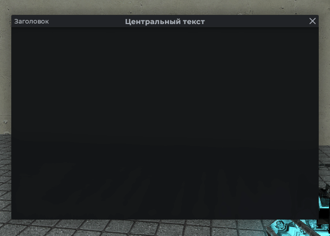
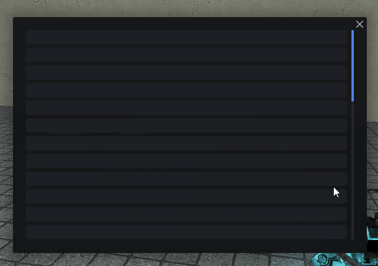
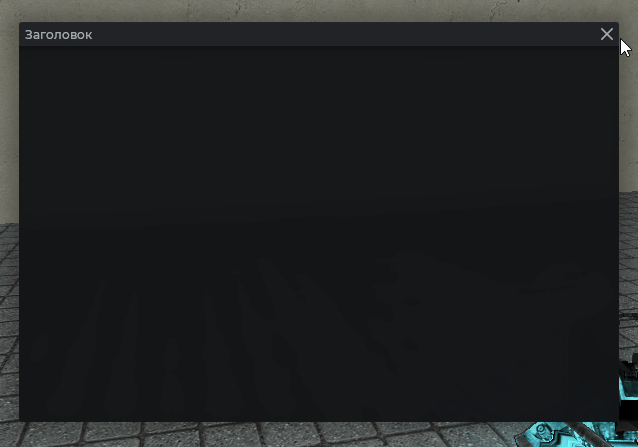
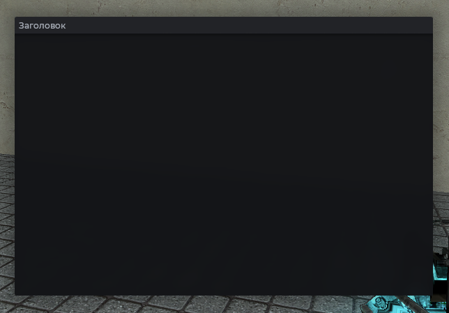
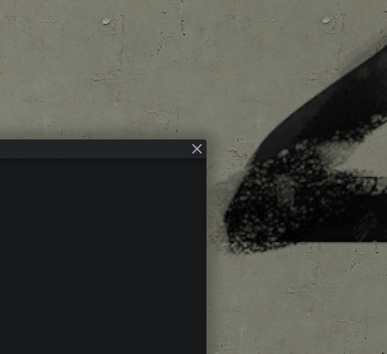

# MantleFrame

Реализация окна для элементов.

## Пример



```js
local frame = vgui.Create('MantleFrame')
frame:SetSize(600, 500)
frame:Center()
frame:MakePopup()
frame:SetTitle('Заголовок')
frame:SetCenterTitle('Центральный текст')
frame:ShowAnimation()
```

## Заголовки

`SetTitle` рисует заголовок слева, `SetCenterTitle` - по центру шапки.

```js
local frame = vgui.Create('MantleFrame')
frame:SetSize(600, 500)
frame:Center()
frame:MakePopup()
frame:SetTitle('Слева')
frame:SetCenterTitle('По центру')
```

## Плавное появление и закрытие

```js
local frame = vgui.Create('MantleFrame')
frame:SetSize(600, 500)
frame:Center()
frame:ShowAnimation() -- метод анимации

-- Закрытие
timer.Simple(2, function()
    if IsValid(frame) then
        frame:Close()
    end
end)
```

## Отключение перетаскивания за шапку

```js
local frame = vgui.Create('MantleFrame')
frame:SetSize(600, 500)
frame:Center()
frame:MakePopup()
frame:SetDraggable(false)
```

## Режим без шапки

Убирает шапку, а также заголовки. Подходит для всплывающих меню.



```js
local frame = vgui.Create('MantleFrame')
frame:SetSize(600, 500)
frame:Center()
frame:MakePopup()
frame:LiteMode()

local sp = vgui.Create('MantleScrollPanel', frame)
sp:Dock(FILL)

for k = 1, 35 do
    local pan = vgui.Create('DPanel', sp)
    pan:Dock(TOP)
    pan:DockMargin(0, 0, 0, 6)
    pan.Paint = function(_, w, h)
        draw.RoundedBox(6, 0, 0, w, h, Mantle.color.panel_alpha[2])
    end
end
```

## Прозрачный фон

Включает/отключает размытый фон. По умолчанию стоит включено.

```js
local frame = vgui.Create('MantleFrame')
frame:SetSize(600, 500)
frame:Center()
frame:MakePopup()

frame:SetAlphaBackground(true)
```

## Уведомление внизу окна



```js
local frame = vgui.Create('MantleFrame')
frame:SetSize(600, 500)
frame:Center()
frame:MakePopup()

timer.Simple(1.5, function()
    frame:Notify('Сохранено', 2) -- текст, длительность
end)
```

## Скрыть кнопку закрытия



```js
local frame = vgui.Create('MantleFrame')
frame:SetSize(600, 500)
frame:Center()
frame:MakePopup()
frame:DisableCloseBtn()

timer.Simple(5, function()
    frame:Close()
end)
```

## Методы

| Метод                                   | Описание                                                   |
| --------------------------------------- | ---------------------------------------------------------- |
| `:SetTitle(string title)`               | Заголовок слева в шапке                                    |
| `:SetCenterTitle(string centerTitle)`   | Заголовок по центру шапки                                  |
| `:SetAlphaBackground(bool isAlpha)`     | Прозрачный фон окна. По умолчанию `true`                   |
| `:SetDraggable(bool isDraggable)`       | Перетаскивание окна. По умолчанию `true`                   |
| `:ShowAnimation()`                      | Анимация появления окна                                    |
| `:Close()`                              | Закрыть окно                                               |
| `:DisableCloseBtn()`                    | Скрыть кнопку закрытия                                     |
| `:LiteMode()`                           | Режим без верхней панели                                   |
| `:Notify(string text, number duration)` | Уведомление внизу окна. Длительность по умолчанию `2 сек.` |

## Примечания

- Кнопка закрытия по ПКМ открывает контекстное меню: переключение прозрачности, отключение ввода, удаление окна.


