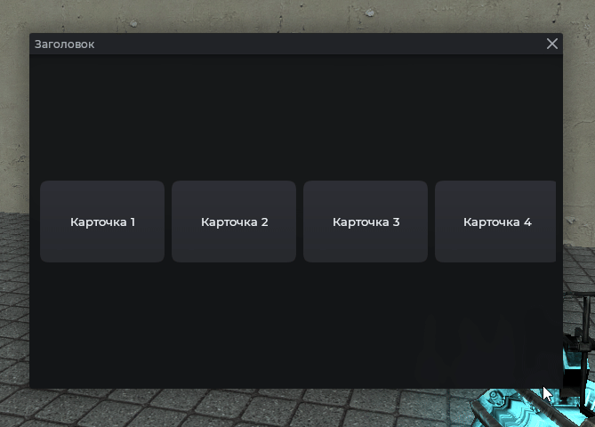

# MantleHScroll

Панель с горизонтальной прокруткой. Контент раскладывается слева направо и обрезается по правому краю. Подходит для лент карточек и иконок.

## Пример



```js
local frame = vgui.Create('MantleFrame')
frame:SetSize(600, 500)
frame:Center()
frame:MakePopup()

local hscroll = vgui.Create('MantleHScroll', frame)
hscroll:Dock(FILL)
hscroll:DockMargin(0, 130, 0, 130)

for i = 1, 10 do
    local btn = vgui.Create('MantleBtn', hscroll)
    btn:Dock(LEFT)
    btn:SetWide(140)
    btn:DockMargin(4, 4, 4, 4)
    btn:SetTxt('Карточка ' .. i)
end
```

## Управление позицией

```js
local frame = vgui.Create('MantleFrame')
frame:SetSize(600, 500)
frame:Center()
frame:MakePopup()

local hscroll = vgui.Create('MantleHScroll', frame)
hscroll:Dock(FILL)

-- Прокрутить к началу
hscroll:SetScroll(0)

-- Текущая позиция
print(hscroll:GetScroll())
```

## Методы

| Метод                                    | Описание                               |
| ---------------------------------------- | -------------------------------------- |
| `:GetCanvas()`                           | Получить панель-контейнер для контента |
| `:AddItem(panel)`                        | Добавить панель в конец ленты          |
| `:SetScroll(number value)`               | Установить горизонтальную позицию      |
| `:GetScroll()`                           | Текущая позиция                        |
| `:Clear()`                               | Удалить всё содержимое                 |
| `:DockPadding(left, top, right, bottom)` | Внутренние отступы                     |

## Примечания

- Полосы прокрутки нет: лента листается колесом мыши или перетаскиванием.
