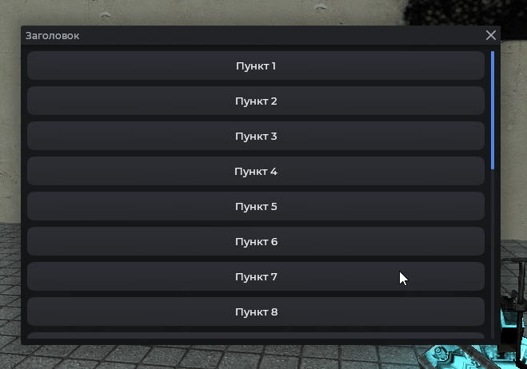
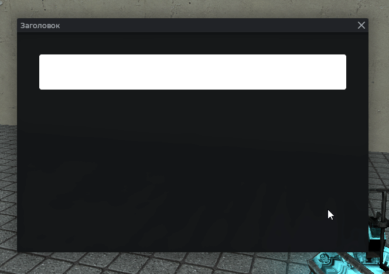
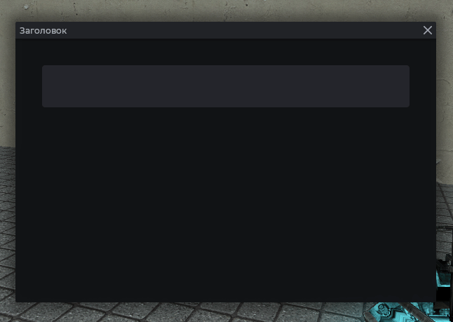

# MantleScrollPanel

Панель с вертикальной прокруткой. Поддерживает прокрутку колесом мыши, перетаскивание контента мышью. Контент раскладывается через `:Dock(TOP)` и автоматически растягивается по ширине.

## Пример



```js
local frame = vgui.Create('MantleFrame')
frame:SetSize(600, 500)
frame:Center()
frame:MakePopup()

local scroll = vgui.Create('MantleScrollPanel', frame)
scroll:Dock(FILL)

for i = 1, 20 do
    local btn = vgui.Create('MantleBtn', scroll:GetCanvas())
    btn:Dock(TOP)
    btn:SetTall(36)
    btn:DockMargin(0, 0, 0, 8)
    btn:SetTxt('Пункт ' .. i)
end
```

## Управление прокруткой из кода

```js
local frame = vgui.Create('MantleFrame')
frame:SetSize(600, 500)
frame:Center()
frame:MakePopup()

local scroll = vgui.Create('MantleScrollPanel', frame)
scroll:Dock(FILL)

for i = 1, 20 do
    local btn = vgui.Create('MantleBtn', scroll:GetCanvas())
    btn:Dock(TOP)
    btn:SetTall(36)
    btn:DockMargin(0, 0, 0, 8)
    btn:SetTxt('Пункт ' .. i)
end

-- Прокрутка вниз
scroll:SetScroll(500)

timer.Simple(2, function()
    -- Наверх
    scroll:SetScroll(0)
end)

-- Узнать текущую позицию
print(scroll:GetScroll())
```

## Очистка содержимого

```js
local frame = vgui.Create('MantleFrame')
frame:SetSize(600, 500)
frame:Center()
frame:MakePopup()

local scroll = vgui.Create('MantleScrollPanel', frame)
scroll:Dock(FILL)

scroll:Clear()
```

Полностью удаляет все панели из CanVas.

## Отступы контента



```js
local frame = vgui.Create('MantleFrame')
frame:SetSize(600, 500)
frame:Center()
frame:MakePopup()

local scroll = vgui.Create('MantleScrollPanel', frame)
scroll:Dock(FILL)
scroll:DockPadding(30, 30, 30, 30)

local pan = vgui.Create('DPanel', scroll:GetCanvas())
pan:Dock(TOP)
pan:SetTall(60)
pan.Paint = function(_, w, h)
    draw.RoundedBox(6, 0, 0, w, h, color_white)
end
```

## Настройка скроллбара

Позволяет включать/отключать отступ между правой панелью прокрутки и содержимым.

```js
local frame = vgui.Create('MantleFrame')
frame:SetSize(600, 500)
frame:Center()
frame:MakePopup()

local scroll = vgui.Create('MantleScrollPanel', frame)
scroll:Dock(FILL)

-- Отключить
scroll:DisableVBarPadding()

-- Регулировать вручную
scroll:SetVBarPaddingRight(true)
```

## Методы

| Метод                                    | Описание                                                       |
| ---------------------------------------- | -------------------------------------------------------------- |
| `:GetCanvas()`                           | Получать панель-контейнер для контента. На неё вешают элементы |
| `:AddItem(panel)`                        | Добавить панель                                                |
| `:SetScroll(number value)`               | Установить позицию скролла по вертикали                        |
| `:GetScroll()`                           | Текущая позиция скролла                                        |
| `:Clear()`                               | Удалить всё содержимое                                         |
| `:DockPadding(left, top, right, bottom)` | Внутренние отступы                                             |
| `:DisableVBarPadding()`                  | Убрать отступ под полосу прокрутки                             |
| `:SetVBarPaddingRight(bool enabled)`     | Включить/выключить отступ справа для полосы                    |

## Примечания

- Полоса прокрутки появляется только при переполнении.
- Прокручивать можно, зажав ЛКМ.


