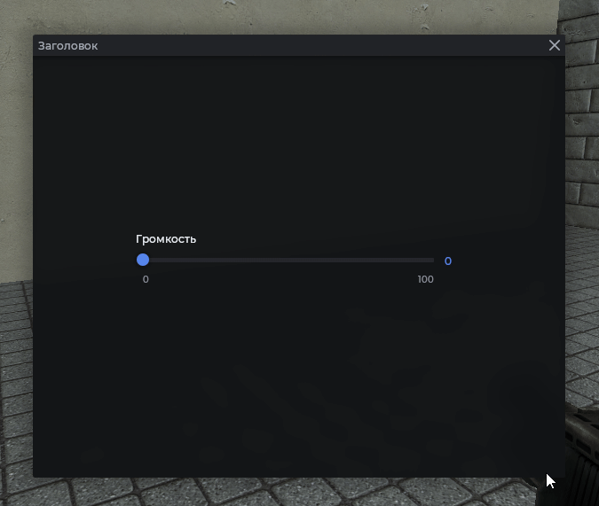
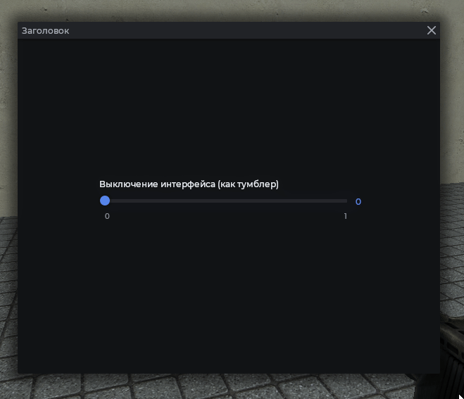

# MantleSlideBox

Слайдер. Поддерживает диапазон значений, дробные числа и привязку к ConVar.

## Пример



```js
local frame = vgui.Create('MantleFrame')
frame:SetSize(600, 500)
frame:Center()
frame:MakePopup()

local slider = vgui.Create('MantleSlideBox', frame)
slider:SetWide(400)
slider:Center()
slider:SetRange(0, 100, 0)
slider:SetText('Громкость')
```

## Чтение и установка значения

```js
local frame = vgui.Create('MantleFrame')
frame:SetSize(600, 500)
frame:Center()
frame:MakePopup()

local slider = vgui.Create('MantleSlideBox', frame)
slider:SetWide(400)
slider:Center()
slider:SetRange(0, 100, 0)
slider:SetText('Громкость')

slider:SetValue(50)
print(slider:GetValue()) -- 50
```

## Обработка изменения

Переопределите `:OnValueChanged`. Срабатывает при каждом движении ползунка.

```js
local frame = vgui.Create('MantleFrame')
frame:SetSize(600, 500)
frame:Center()
frame:MakePopup()

local slider = vgui.Create('MantleSlideBox', frame)
slider:SetWide(400)
slider:Center()
slider:SetRange(0, 1, 2)
slider:SetText('Прозрачность')

slider.OnValueChanged = function(self, value)
    print('Прозрачность:', value)
end
```

## Привязка к ConVar

Значение синхронизируется с ConVar, а движение ползунка переписывает его.



```js
local frame = vgui.Create('MantleFrame')
frame:SetSize(600, 500)
frame:Center()
frame:MakePopup()

local slider = vgui.Create('MantleSlideBox', frame)
slider:SetWide(400)
slider:Center()
slider:SetRange(0, 1)
slider:SetText('Выключение интерфейса (как тумблер)')
slider:SetConvar('cl_drawhud')
```

`SetRange(min, max, decimals)` - третий аргумент задаёт количество знаков после запятой.

## Методы

| Метод                                       | Описание                                                        |
| ------------------------------------------- | --------------------------------------------------------------- |
| `:SetRange(int min, int max, int decimals)` | Диапазон и знаки после запятой. По умолчанию `0..1`, `0` знаков |
| `:SetConvar(string convar)`                 | Привязать к ConVar                                              |
| `:SetText(string text)`                     | Подпись слева                                                   |
| `:SetValue(number value)`                   | Установить значение                                             |
| `:GetValue()`                               | Текущее значение                                                |
| `:OnValueChanged(panel self, number value)` | Вызывается при изменении                                        |
