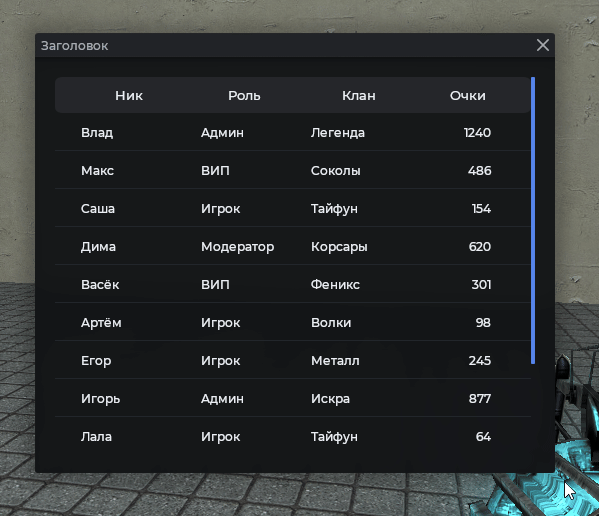
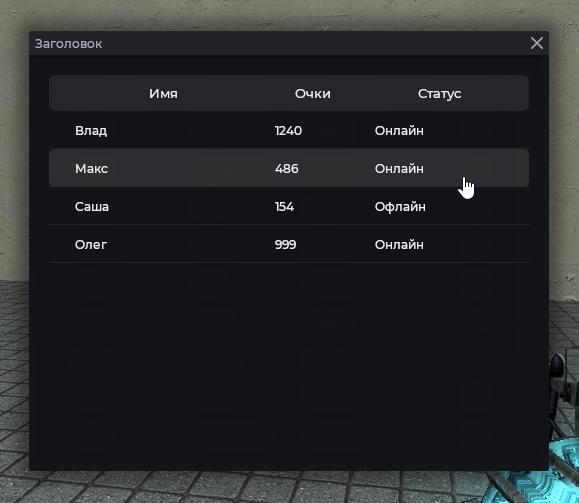

# MantleTable

Таблица с колонками, выделением строк и сортировкой. Строки прокручиваются, заголовок остаётся на месте.

## Пример



```js
local frame = vgui.Create('MantleFrame')
frame:SetSize(520, 440)
frame:Center()
frame:MakePopup()

local tbl = vgui.Create('MantleTable', frame)
tbl:Dock(FILL)
tbl:DockMargin(12, 12, 12, 12)

local cols = {
    { 'Ник', 120, TEXT_ALIGN_LEFT, true },
    { 'Роль', 110, TEXT_ALIGN_LEFT, true },
    { 'Клан', 120, TEXT_ALIGN_LEFT, true },
    { 'Очки', 90, TEXT_ALIGN_RIGHT, true },
}

for _, col in ipairs(cols) do
    tbl:AddColumn(col[1], col[2], col[3], col[4])
end

local data = {
    { 'Влад', 'Админ', 'Легенда', 1240 },
    { 'Макс', 'ВИП', 'Соколы', 486 },
    { 'Саша', 'Игрок', 'Тайфун', 154 },
    { 'Дима', 'Модератор', 'Корсары', 620 },
    { 'Васёк', 'ВИП', 'Феникс', 301 },
    { 'Артём', 'Игрок', 'Волки', 98 },
    { 'Егор', 'Игрок', 'Металл', 245 },
    { 'Игорь', 'Админ', 'Искра', 877 },
    { 'Лала', 'Игрок', 'Тайфун', 64 },
    { 'Паша', 'Модератор', 'Соколы', 512 },
    { 'Олег', 'ВИП', 'Корсары', 999 },
    { 'Мангол', 'Игрок', 'Волки', 187 },
}

for i = 1, #data do
    tbl:AddItem(unpack(data[i]))
end
```

## Сортировка по колонке

Сортировка включается кликом по заголовку. Для этого колонка помечается сортируемой.

```js
local frame = vgui.Create('MantleFrame')
frame:SetSize(520, 440)
frame:Center()
frame:MakePopup()

local tbl = vgui.Create('MantleTable', frame)
tbl:Dock(FILL)
tbl:DockMargin(12, 12, 12, 12)

tbl:AddColumn('Ник', 200, nil, true) -- если false, то не сортируемая
tbl:AddColumn('Очки', 100, nil, true) -- по умолчанию false

tbl:AddItem('darkf', 42)
tbl:AddItem('john', 5)
tbl:AddItem('sasha', 150)
tbl:AddItem('max', 87)
tbl:AddItem('dima', 33)
```

## Выравнивание колонок



```js
local frame = vgui.Create('MantleFrame')
frame:SetSize(520, 440)
frame:Center()
frame:MakePopup()

local tbl = vgui.Create('MantleTable', frame)
tbl:Dock(FILL)
tbl:DockMargin(12, 12, 12, 12)

-- Выравнивание: 'left', 'center', 'right'
tbl:AddColumn('Имя', 200, 'left')
tbl:AddColumn('Очки', 100, 'center', true)
tbl:AddColumn('Статус', 80, 'right')

tbl:AddItem('Влад', 1240, 'Онлайн')
tbl:AddItem('Макс', 486, 'Онлайн')
tbl:AddItem('Саша', 154, 'Офлайн')
tbl:AddItem('Олег', 999, 'Онлайн')
```

## Действия над строками

```js

local frame = vgui.Create('MantleFrame')
frame:SetSize(520, 440)
frame:Center()
frame:MakePopup()

local tbl = vgui.Create('MantleTable', frame)
tbl:Dock(FILL)
tbl:DockMargin(12, 12, 12, 12)

tbl:AddColumn('Ник', 160)
tbl:AddColumn('Роль', 140)
tbl:AddColumn('Очки', 90)

tbl:AddItem('darkf', 'Админ', 42)
tbl:AddItem('john', 'Игрок', 5)
tbl:AddItem('sasha', 'ВИП', 150)
tbl:AddItem('max', 'Модератор', 87)
tbl:AddItem('dima', 'Игрок', 33)

-- Клик по строке
tbl:SetAction(function(row)
    print('Клик по строке')
    PrintTable(row)
end)

-- ПКМ по строке
tbl:SetRightClickAction(function(row)
    print('ПКМ по строке')
    PrintTable(row)
end)
```

## Удаление строки

```js
local frame = vgui.Create('MantleFrame')
frame:SetSize(520, 440)
frame:Center()
frame:MakePopup()

local tbl = vgui.Create('MantleTable', frame)
tbl:Dock(FILL)
tbl:DockMargin(12, 12, 12, 12)

tbl:AddColumn('Ник', 300)

tbl:AddItem('darkf')
tbl:AddItem('john')
tbl:AddItem('sasha')
tbl:AddItem('max')

-- Удалить первую строку (нумерация с 1)
tbl:RemoveRow(1)

print(tbl:GetRowCount()) -- 3
```

## Методы

| Метод                                                             | Описание                                    |
| ----------------------------------------------------------------- | ------------------------------------------- |
| `:AddColumn(string name, int width, string align, bool sortable)` | Колонка. `align`: `left`, `center`, `right` |
| `:AddItem(...)`                                                   | Добавить строку. Возвращает номер строки    |
| `:SortByColumn(int columnIndex)`                                  | Программная сортировка                      |
| `:SetAction(function func)`                                       | Действие при ЛКМ: `func(row)`               |
| `:SetRightClickAction(function func)`                             | Действие при ПКМ: `func(row)`               |
| `:Clear()`                                                        | Очистка                                     |
| `:GetSelectedRow()`                                               | Индекс выбранной строки или `nil`           |
| `:GetRowCount()`                                                  | Количество строк                            |
| `:RemoveRow(int index)`                                           | Удалить строку по индексу                   |

## Примечания

- ПКМ по строке показывает меню с пунктами "Копировать значение" и "Удалить строку".
- Повторный клик по сортируемой колонке меняет направление сортировки.
