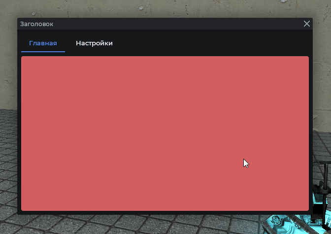
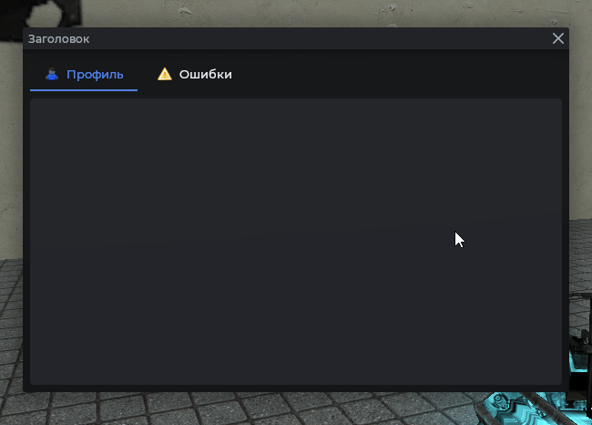
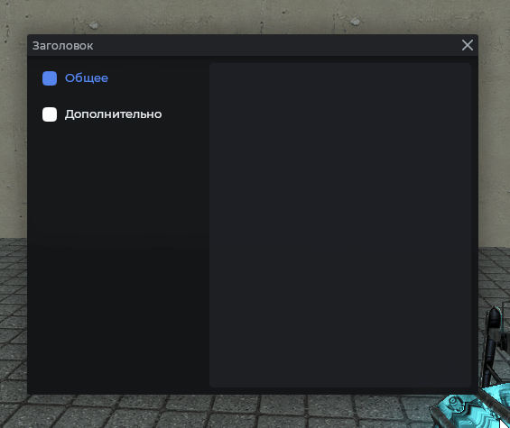
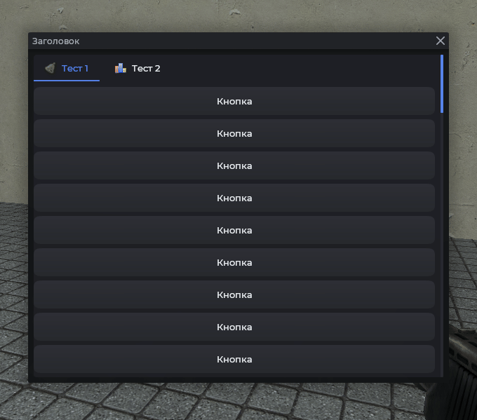
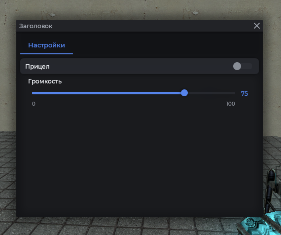

# MantleTabs

Вкладки с переключением контента. Два стиля: `modern` (вкладки сверху) и `classic` (список слева).

## Пример



```js
local frame = vgui.Create('MantleFrame')
frame:SetSize(600, 500)
frame:Center()
frame:MakePopup()

local tabs = vgui.Create('MantleTabs', frame)
tabs:Dock(FILL)

local page1 = vgui.Create('Panel', tabs)
page1.Paint = function(_, w, h)
    draw.RoundedBox(6, 0, 0, w, h, Color(210, 95, 95))
end
tabs:AddTab('Главная', page1)

local page2 = vgui.Create('Panel', tabs)
page2.Paint = function(_, w, h)
    draw.RoundedBox(6, 0, 0, w, h, Color(95, 210, 95))
end
tabs:AddTab('Настройки', page2)
```

## Переключение из кода

```js
local frame = vgui.Create('MantleFrame')
frame:SetSize(600, 500)
frame:Center()
frame:MakePopup()

local tabs = vgui.Create('MantleTabs', frame)
tabs:Dock(FILL)

local page1 = vgui.Create('Panel', tabs)
page1.Paint = function(_, w, h)
    draw.RoundedBox(6, 0, 0, w, h, Color(210, 95, 95))
end
tabs:AddTab('Главная', page1)

local page2 = vgui.Create('Panel', tabs)
page2.Paint = function(_, w, h)
    draw.RoundedBox(6, 0, 0, w, h, Color(95, 210, 95))
end
tabs:AddTab('Настройки', page2)

-- Активировать вторую вкладку (нумерация с 1)
tabs:SetActiveTab(2)
```

## Вкладки с иконкой



```js
local frame = vgui.Create('MantleFrame')
frame:SetSize(600, 500)
frame:Center()
frame:MakePopup()

local tabs = vgui.Create('MantleTabs', frame)
tabs:Dock(FILL)

local page1 = vgui.Create('Panel', tabs)
page1.Paint = function(_, w, h)
    draw.RoundedBox(6, 0, 0, w, h, Mantle.color.panel_alpha[1])
end
tabs:AddTab({ title = 'Профиль', icon = Material('icon16/user.png') }, page1)

local page2 = vgui.Create('Panel', tabs)
page2.Paint = function(_, w, h)
    draw.RoundedBox(6, 0, 0, w, h, Mantle.color.panel_alpha[1])
end
tabs:AddTab({ title = 'Ошибки', icon = Material('icon16/error.png') }, page2)
```

## Классический стиль

Список вкладок располагается слева.



```js
local frame = vgui.Create('MantleFrame')
frame:SetSize(600, 500)
frame:Center()
frame:MakePopup()

local tabs = vgui.Create('MantleTabs', frame)
tabs:Dock(FILL)
tabs:SetTabStyle('classic')

local page1 = vgui.Create('DPanel', tabs)
page1.Paint = function(_, w, h)
    draw.RoundedBox(6, 0, 0, w, h, Mantle.color.panel_alpha[2])
end
tabs:AddTab('Общее', page1)

local page2 = vgui.Create('DPanel', tabs)
page2.Paint = function(_, w, h)
    draw.RoundedBox(6, 0, 0, w, h, Mantle.color.panel_alpha[3])
end
tabs:AddTab('Дополнительно', page2)
```

## Вкладки со скроллом

Благодаря постепенной тени и размытию сверху создаётся плавный эффект перехода.



```js
local frame = vgui.Create('MantleFrame')
frame:SetSize(600, 500)
frame:Center()
frame:MakePopup()

local tabs = vgui.Create('MantleTabs', frame)
tabs:Dock(FILL)

local function createElements(parent)
    for k = 1, 50 do
        local btn = vgui.Create('MantleBtn', parent)
        btn:Dock(TOP)
        btn:DockMargin(0, 0, 0, 6)
        btn:SetTall(40)
    end
end

local page1 = vgui.Create('MantleScrollPanel', tabs)
page1.Paint = function(_, w, h)
    draw.RoundedBox(6, 0, 0, w, h, Mantle.color.panel_alpha[2])
end
createElements(page1)
tabs:AddTab({ title = 'Тест 1', icon = Material('icon16/bell.png') }, page1)

local page2 = vgui.Create('MantleScrollPanel', tabs)
page2.Paint = function(_, w, h)
    draw.RoundedBox(6, 0, 0, w, h, Mantle.color.panel_alpha[2])
end
createElements(page2)
tabs:AddTab({ title = 'Тест 2', icon = Material('icon16/chart_bar.png') }, page2)
```

## Страницы с элементами



```js
local frame = vgui.Create('MantleFrame')
frame:SetSize(600, 500)
frame:Center()
frame:MakePopup()

local tabs = vgui.Create('MantleTabs', frame)
tabs:Dock(FILL)

local settings = vgui.Create('Panel', tabs)
local cb = vgui.Create('MantleCheckBox', settings)
cb:Dock(TOP)
cb:SetTxt('Прицел')

local slider = vgui.Create('MantleSlideBox', settings)
slider:Dock(TOP)
slider:SetRange(0, 100, 0)
slider:SetText('Громкость')

tabs:AddTab('Настройки', settings)
```

## Методы

| Метод                                        | Описание                                                              |
| -------------------------------------------- | --------------------------------------------------------------------- |
| `:AddTab(string\|table tab, DPanel panel)`   | Добавить вкладку. `tab` может быть строкой или `{ title, icon, ... }` |
| `:SetActiveTab(int\|string id, bool silent)` | Переключить вкладку. `silent` отключает анимацию                      |
| `:SetTabStyle(string style)`                 | Стиль: `modern` или `classic`. По умолчанию `modern`                  |
| `:SetTabHeight(int height)`                  | Высота области вкладок. По умолчанию `38`                             |
| `:SetIndicatorHeight(int height)`            | Толщина полосы активной вкладки. По умолчанию `2`                     |
