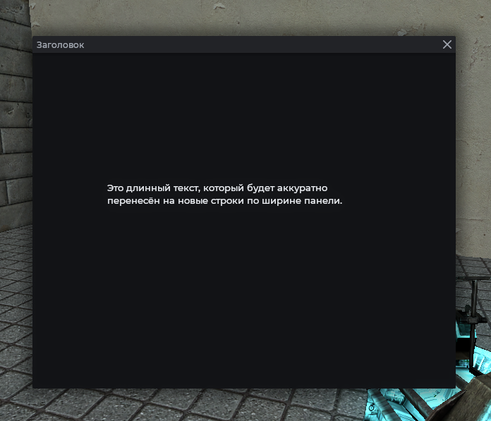
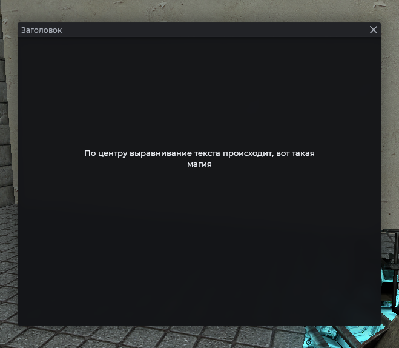

# MantleText

Многострочный текст с переносом по словам и многоточием при переполнении. Поддерживает кириллицу.

## Пример



```js
local frame = vgui.Create('MantleFrame')
frame:SetSize(600, 500)
frame:Center()
frame:MakePopup()

local text = vgui.Create('MantleText', frame)
text:SetSize(400, 100)
text:Center()
text:SetText('Это длинный текст, который будет аккуратно перенесён на новые строки по ширине панели.')
```

## Шрифт и цвет

```js
local frame = vgui.Create('MantleFrame')
frame:SetSize(600, 500)
frame:Center()
frame:MakePopup()

local text = vgui.Create('MantleText', frame)
text:SetSize(400, 100)
text:Center()
text:SetText('Заголовок раздела')
text:SetFont('Fated.22b')
text:SetColor(Mantle.color.text)
```

## Выравнивание

`SetAlign` выравнивает по горизонтали, `SetVAlign` по вертикали.



```js
local frame = vgui.Create('MantleFrame')
frame:SetSize(600, 500)
frame:Center()
frame:MakePopup()

local text = vgui.Create('MantleText', frame)
text:SetSize(400, 100)
text:Center()
text:SetText('По центру выравнивание текста происходит, вот такая магия')
text:SetAlign(TEXT_ALIGN_CENTER)
text:SetVAlign(TEXT_ALIGN_CENTER)
```

## Внутренние отступы

```js
local frame = vgui.Create('MantleFrame')
frame:SetSize(600, 500)
frame:Center()
frame:MakePopup()

local text = vgui.Create('MantleText', frame)
text:SetSize(400, 100)
text:Center()
text:SetText('Текст с отступами')
text:SetPadding(12)
```

## Методы

| Метод                               | Описание                                                                                                              |
| ----------------------------------- | --------------------------------------------------------------------------------------------------------------------- |
| `:SetText(string text)`             | Установить текст                                                                                                      |
| `:GetText()`                        | Текущий текст                                                                                                         |
| `:SetFont(string font)`             | Шрифт. По умолчанию `Fated.16`                                                                                        |
| `:SetColor(color color)`            | Цвет текста                                                                                                           |
| `:SetAlign(number align)`           | Выравнивание по горизонтали                                                                                           |
| `:SetVAlign(string\|number valign)` | Выравнивание по вертикали: `'top'`/`'center'`/`'bottom'` или `TEXT_ALIGN_TOP`/`TEXT_ALIGN_CENTER`/`TEXT_ALIGN_BOTTOM` |
| `:SetPadding(int padding)`          | Внутренние отступы. По умолчанию `6`                                                                                  |

## Примечания

- Поддерживается кириллица через UTF-8.
